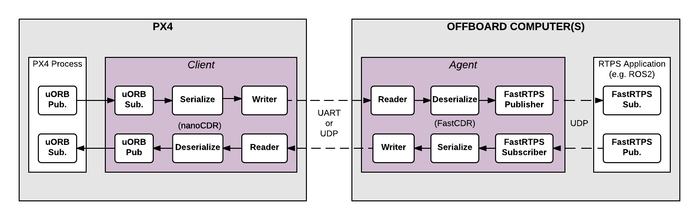

# DDS_MQTT_NodeRED
This is a bridge between DDS and MQTT and tested with PX4(Fast DDS) and PahoMQTT for Node-RED.

## How to Setup
### Pre-requirements (just show what I'm using)
- One HP elitebook 1050 G1 with (32core 32BG with GTX1050 GPU)
- Ubuntu Linux 5.13.0-46-generic x86_64
### Step 1 - Install PX4
```
git clone https://github.com/PX4/PX4-Autopilot.git --recursive
bash ./PX4-Autopilot/Tools/setup/ubuntu.sh
sudo snap install ant
```
### Step 2 - Install QgroundControl
```
sudo usermod -a -G dialout $USER
sudo apt-get remove modemmanager -y
sudo apt install gstreamer1.0-plugins-bad gstreamer1.0-libav gstreamer1.0-gl -y
sudo apt install libqt5gui5 -y
wget https://d176tv9ibo4jno.cloudfront.net/latest/QGroundControl.AppImage
chmod +x ./QGroundControl.AppImage
```
### Step 3 - Fast DDS Installation
make sure that Java JDK 11 is installed.
make sure that Gradle is installed. It's 6.3 not 7.x.
```
git clone https://github.com/eProsima/foonathan_memory_vendor.git
cd foonathan_memory_vendor
mkdir build && cd build
cmake ..
sudo cmake --build . --target install

git clone --recursive https://github.com/eProsima/Fast-DDS.git -b v2.0.2 ~/FastDDS-2.0.2
cd ~/FastDDS-2.0.2
mkdir build
cd build
cmake -DTHIRDPARTY=ON -DSECURITY=ON -DCOMPILE_EXAMPLES=ON -DPERFORMANCE_TESTS=ON ..
make -j$(nproc --all)
sudo make install

git clone --recursive https://github.com/eProsima/Fast-DDS-Gen.git -b v1.0.4 ~/Fast-RTPS-Gen \
    && cd ~/Fast-RTPS-Gen \
    && gradle assemble \
    && sudo env "PATH=$PATH" gradle install
```
### Step 4 - Test out PX4 + QgroundControl with jMAVSim with RTPS
```
./QGroundControl.AppImage (or double click)
make px4_sitl_rtps jmavsim (you may fail ude to lack of some python packages and install them based on cmake output information.)
```
### Step 5 - setup RTPS/DDS Interface: PX4-Fast RTPS(DDS) Bridge

The PX4-Fast RTPS(DDS) Bridge, which is also referred to as as the microRTPS Bridge, adds a Real Time Publish Subscribe (RTPS) interface to the PX4 Autopilot, enabling the exchange of uORB messages between the various PX4 Autopilot internal components and (offboard) Fast DDS applications in realtime.
#### The microRTPS Client
The Client is the PX4 Autopilot middleware daemon process that runs on the flight controller. This client subscribes to uORB topics published by other PX4 Autopilot components and sends any updates to the Agent (via a UART or UDP port), and also receives messages from the Agent and publishes them as uORB messages to the PX4 Autopilot.

#### The microRTPS Agent
The Agent runs as a daemon process on an offboard computer (outside the flight controller). This agent watches for uORB update messages from the Client and (re)publishes them over RTPS, and also subscribes to "uORB" RTPS/DDS messages from other DDS-participant applications and forwards them to the Client.

#### microRTPS Agent/Client Communication
The Agent and Client are connected via a serial link (UART) or UDP network, and the uORB information is CDR serialized (opens new window)before being sent (CDR serialization provides a common format for exchanging serial data between different platforms).

The Agent and any Fast DDS applications are connected via UDP and may be on the same or another device. In a typical configuration, they will be on the same system (e.g., a development computer, Linux companion computer, or compute board), connected to the Client. This can be through a Wifi link or USB.

### Step 6 - Fast RTPS(DDS) Applications (ROS Independent)
All the code needed to create, build and use the bridge is automatically generated when PX4-Autopilot is compiled.

The Client application is also compiled and built into the firmware as part of the normal build process. The Agent must be separately/manually compiled for the target computer.

#### Supported uORB messages
The generated bridge code will enable a specified subset of uORB topics to be published/subscribed via RTPS, regardless if you are deploying a ROS application or not.

For automatic code generation there's a yaml definition file in the PX4 PX4-Autopilot/msg/tools/ directory called uorb_rtps_message_ids.yaml. This file defines the set of uORB messages to be used with RTPS, whether the messages are to be sent, received or both, and the RTPS ID for the message to be used in DDS/RTPS middleware.

#### Client (PX4/PX4-Autopilot)
The Client source code is generated, compiled and built into the PX4 Autopilot firmware as part of the normal build process.

To build the PX4 Autopilot firmware for NuttX/Pixhawk flight controllers use the _rtps feature in the configuration target.
```
make px4_sitl_rtps
```
The Client application can be launched from NuttShell/System Console. The command syntax is shown below (you can specify a variable number of arguments):
```
micrortps_client start|stop|status [options]
  -t <transport>          [UART|UDP] Default UART
  -d <device>             UART device. Default /dev/ttyACM0
  -l <loops>              How many iterations will this program have. -1 for infinite. Default -1.
  -w <sleep_time_ms>      Time in ms for which each iteration sleep. Default 1ms
  -b <baudrate>           UART device baudrate. Default 460800
  -p <poll_ms>            Time in ms to poll over UART. Default 1ms
  -r <reception port>     UDP port for receiving. Default 2019
  -s <sending port>       UDP port for sending. Default 2020
  -i <ip_address>         Select IP address (remote) values: <x.x.x.x>. Default: 127.0.0.1
```
By default the Client runs as a daemon, but it does not automatically start, and must be manually launched.
The PX4 Autopilot firmware initialization code may in future automatically start the Client as a permanent daemon process.
For example, in order to run the Client daemon with SITL connecting to the Agent via UDP:
```
micrortps_client start -t UDP
```
#### Agent in an Offboard Fast DDS interface (ROS-independent)
The Agent code is automatically generated when you build the associated PX4 Autopilot firmware, and you can find the source here and build it:
```
cd ~/PX4-Autopilot/build/px4_sitl_rtps/src/modules/micrortps_bridge/micrortps_agent
mkdir build && cd build
cmake ..
make
```
As an example, to start the micrortps_agent with connection through UDP, issue:
```
./micrortps_agent -t UDP
```
#### Creating a Fast DDS Listener application
Once the Client (on the flight controller) and the Agent (on an offboard computer) are running and connected, Fast DDS applications can publish and subscribe to uORB topics on the PX4 Autopilot using RTPS.

This example shows how to create a Fast DDS "listener" application that subscribes to the sensor_combined topic and prints out updates published from the PX4 Autopilot. A connected RTPS application can run on any computer on the same network as the Agent. For this example the Agent and Listener application will be on the same computer.

The fastrtpsgen script can be used to generate a simple RTPS application from an IDL message file.

<b>Note:</b>

RTPS messages are defined in IDL files and compiled to C++ using fastrtpsgen.

When building the bridge code, IDL files are generated for the uORB messages that may be sent/received, these IDL files are needed when you create a Fast DDS application to communicate with the PX4 Autopilot.

You can find them in following path per build target: build/BUILDPLATFORM/src/modules/micrortps_bridge/micrortps_agent/idl/*.idl.
Enter the following commands to create the application:
```
cd /path/to/PX4/PX4-Autopilot
cd build/px4_sitl_rtps/src/modules/micrortps_bridge
mkdir micrortps_listener
cd micrortps_listener
fastrtpsgen -example x64Linux2.6gcc ../micrortps_agent/idl/sensor_combined.idl
```
This creates a basic subscriber and publisher, and a main-application that you can run.

In order to print the data from the sensor combined topic, modify the following methods in sensor_combined_Subscriber.cxx:

init(): To change the subscription topic name (by default, the micrortps agent publishes the data on the named topic: fmu/sensor_combined/out),
onNewDataMessage(): To print the received sensor combined data.
```
bool sensor_combinedSubscriber::init(Subscriber* sub)
{
    // Create RTPSParticipant

    ParticipantAttributes PParam;
    PParam.rtps.setName("Participant_subscriber"); //You can put the name you want
    mp_participant = Domain::createParticipant(PParam);
    if(mp_participant == nullptr)
    {
        return false;
    }

    //Register the type

    Domain::registerType(mp_participant, static_cast<TopicDataType*>(&myType));

    // Create Subscriber

    SubscriberAttributes Rparam;
    Rparam.topic.topicKind = NO_KEY;
    Rparam.topic.topicDataType = myType.getName(); //Must be registered before the creation of the subscriber
    Rparam.topic.topicName = "fmu/sensor_combined/out";
    mp_subscriber = Domain::createSubscriber(mp_participant,Rparam, static_cast<SubscriberListener*>(&m_listener));
    if(mp_subscriber == nullptr)
    {
        return false;
    }
    return true;
}
```
```
void sensor_combinedSubscriber::SubListener::onNewDataMessage(Subscriber* sub)
{
    // Take data
    sensor_combined_ st;

    if(sub->takeNextData(&st, &m_info))
    {
        if(m_info.sampleKind == ALIVE)
        {
            // Print your structure data here.
            ++n_msg;
            std::cout << "\n\n\n\n\n\n\n\n\n\n";
            std::cout << "Sample received, count=" << n_msg << std::endl;
            std::cout << "=============================" << std::endl;
            std::cout << "gyro_rad: " << st.gyro_rad().at(0);
            std::cout << ", " << st.gyro_rad().at(1);
            std::cout << ", " << st.gyro_rad().at(2) << std::endl;
            std::cout << "gyro_integral_dt: " << st.gyro_integral_dt() << std::endl;
            std::cout << "accelerometer_timestamp_relative: " << st.accelerometer_timestamp_relative() << std::endl;
            std::cout << "accelerometer_m_s2: " << st.accelerometer_m_s2().at(0);
            std::cout << ", " << st.accelerometer_m_s2().at(1);
            std::cout << ", " << st.accelerometer_m_s2().at(2) << std::endl;
            std::cout << "accelerometer_integral_dt: " << st.accelerometer_integral_dt() << std::endl;
            std::cout << "magnetometer_timestamp_relative: " << st.magnetometer_timestamp_relative() << std::endl;
            std::cout << "magnetometer_ga: " << st.magnetometer_ga().at(0);
            std::cout << ", " << st.magnetometer_ga().at(1);
            std::cout << ", " << st.magnetometer_ga().at(2) << std::endl;
            std::cout << "baro_timestamp_relative: " << st.baro_timestamp_relative() << std::endl;
            std::cout << "baro_alt_meter: " << st.baro_alt_meter() << std::endl;
            std::cout << "baro_temp_celcius: " << st.baro_temp_celcius() << std::endl;

        }
    }
}
```
To build and run the application on Linux:
```
make -f makefile_x64Linux2.6gcc
bin/*/sensor_combined_PublisherSubscriber subscriber
```
Now you should see the sensor information being printed out:
```
Sample received, count=10119
Received sensor_combined data
=============================
gyro_rad: -0.0103228, 0.0140477, 0.000319406
gyro_integral_dt: 0.004
accelerometer_timestamp_relative: 0
accelerometer_m_s2: -2.82708, -6.34799, -7.41101
accelerometer_integral_dt: 0.004
magnetometer_timestamp_relative: -10210
magnetometer_ga: 0.60171, 0.0405879, -0.040995
baro_timestamp_relative: -17469
baro_alt_meter: 368.647
baro_temp_celcius: 43.93
```
### Step 7 - Install paho mqtt library.
```
sudo apt-get install build-essential gcc make cmake cmake-gui cmake-curses-gui
sudo apt-get install libssl-dev
$ sudo apt-get install doxygen graphviz
```
(Optional) install Catch 2.
Before build cpp library, need to build c library
```
$ git clone https://github.com/eclipse/paho.mqtt.c.git
$ cd paho.mqtt.c
$ git checkout v1.3.8

$ cmake -Bbuild -H. -DPAHO_ENABLE_TESTING=OFF -DPAHO_BUILD_STATIC=ON \
    -DPAHO_WITH_SSL=ON -DPAHO_HIGH_PERFORMANCE=ON
$ sudo cmake --build build/ --target install
$ sudo ldconfig
```
This builds with SSL/TLS enabled. If that is not desired, omit the -DPAHO_WITH_SSL=ON.

It also uses the "high performace" option of the C library to disable more extensive internal memory checks. Remove the PAHO_HIGH_PERFORMANCE option (i.e. turn it off) to debug memory issues, but for most production systems, leave it on for better performance.

To install the library to a non-standard location, use the CMAKE_INSTALL_PREFIX to specify a location. For example, to install into under the build directory, perhaps for local testing, do this:
```
$ cmake -Bbuild -H. -DPAHO_ENABLE_TESTING=OFF -DPAHO_BUILD_STATIC=ON \
    -DPAHO_WITH_SSL=ON -DPAHO_HIGH_PERFORMANCE=ON \
    -DCMAKE_INSTALL_PREFIX=./build/_install
```
Building the Paho C++ library
```
$ git clone https://github.com/eclipse/paho.mqtt.cpp
$ cd paho.mqtt.cpp

$ cmake -Bbuild -H. -DPAHO_BUILD_STATIC=ON \
    -DPAHO_BUILD_DOCUMENTATION=TRUE -DPAHO_BUILD_SAMPLES=TRUE
$ sudo cmake --build build/ --target install
$ sudo ldconfig
```
If you did not install Paho C library to a default system location or you want to build against a different version, use the CMAKE_PREFIX_PATH to specify its install location. Perhaps something like this:
```
cmake -Bbuild -H. -DPAHO_BUILD_DOCUMENTATION=ON -DPAHO_BUILD_SAMPLES=ON \
    -DPAHO_BUILD_STATIC=ON \
    -DCMAKE_PREFIX_PATH=$HOME/mqtt/paho.mqtt.c/build/_install
```
To use another compiler, either the CXX environment variable can be specified in the configuration step:
```
$ CXX=clang++ cmake ..
```
or the CMAKE_CXX_COMPILER flag can be used:
```
$ cmake -DCMAKE_CXX_COMPILER=clang++
```
### Step 8 - combine Fast DDS listener with MQTT client.

